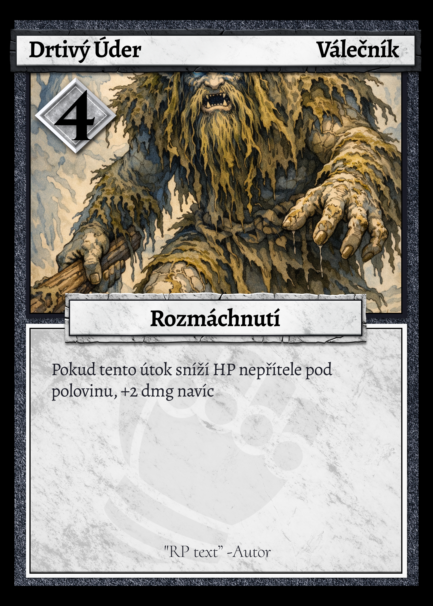

# RAENTIR - D&D-like deckbuilding stolní hra

## ÚVOD

> help: pull first, push last, tag pouze na verzování minor jinak commit
> 
> git add .
> 
> git commit -m "verze"
> 
> git tag x.x.0 -m "název"
> 
> git push --tags
> 
> Poznámky a TODO jsou označny `takto` 

#### Historie verzí:

###### v0.0.1 -_ 1.4.2026_

* Vytvořen první dokument pravidel

###### v0.0.2 - _2.4.2026_

* Vytvořena kostra pravidel

###### v0.0.3 - _2.4.2026_

* Upravena struktura  
* Přidány karty a traity  

###### v0.0.4 - _4.4.2026_

* Přidány templaty karet  
* Rozšířeny pravidla  

###### v0.1.0 (playtest\_alpha) - _4.4.2026_

* Přidány templaty všech typů herních karet  
* Popsány funkce traitů  
* Vytvořen **playtest** balíček základních karet, nepřítele a dvou postav 

###### v0.1.1 - *6.4.2026*

- Po prvním playtestu

- Přepsány pravidla pro dobírání karet, balíčky, souboje a další

###### v0.1.2 - *8.4.2026*

- Přidány staty (reprezentují permanentní traity - TODO)

- Přidáno rozložení stolu

- V content folder přidán prototyp deníku postavy

---

# PRAVIDLA

## Cíl

Hra s deckbuilding kartami a vyprávěným příběhem podobně jako v D&D, kde se vypravěč aktivněji účastní soubojů proti ostatním hráčům a zároveň jim vede hru.

---

## Vypravěč

Vede příběh, situace a ovládá nepřátele. Vytváří konflikty a udává následky. Hráči reagují pomocí roleplaye, v případě konfliktu vypravěč přechází do "režimu hráče" a vede souboj.

Vypravěč má tedy dvojí roli. Jednak vede příběh a jednak řídí obtížnost a tempo hry. Neměl by se snažit hráče „porazit“, ale vytvářet zajímavé situace.  
Důležité je, že má nástroje, jak reagovat na hráče i mimo čistý boj. Může upravit svět, změnit reakce NPC, přidat postih ve formě negativního traitu a nebo naopak přidat pozitivní trait za kvalitní řešení situací stran hráčů. Má také možnost rozdávat speciální traity za určité milníky ve výpravě družiny nebo skupinové a dočasné traity.

---

## Postavy

Nejsou definované a tvořené jako v klasickém D&D, ale jeednodušeji pomocí statů a traitů. Staty a Traity ovlivňují chování postavy vůči světu a naopak. Jsou jak soubojové tak příběhové.

###### Staty

- Postava má **6** statů rozdělených na Tělo a Mysl, které se používají **výhradně v RP**, ne v souboji.
- Hráč při tvorbě postavy rozdělí body mezi staty (viz. Tvorba postavy). Rasa a povolání mohou přidat bonus na konkrétní stat.

| Skupina | Stat    | Použití                              |
| ------- |:------- | ------------------------------------ |
| Tělo    | Síla    | fyzická akce, zastrašování, potyčky  |
| Tělo    | Hbitost | plížení, úniky, reflexy              |
| Tělo    | Výdrž   | odolávání únavě, bolesti a prostředí |
| Mysl    | Rozum   | analýza, technika, věda              |
| Mysl    | Vliv    | přesvědčování, lhaní, vedení         |
| Mysl    | Vnímání | pozornost, intuice, odhalování lží   |

###### Hod na stat

Pakliže Vypravěč rozhodne o tom, že daná akce/situace vyžaduje Hod na stat, pak hráč hodí a vyhodnotí **d20 + příslušný stat + Dočasný trait** dle prahu:

- 1-6: Neúspěch
- 7-13: Rozhodne Vypravěč (komplikace, částečný úspěch...)
- 14-20: Úspěch

###### Deník postavy

Každá postava má svůj deník, který si hráč vypracuje při tvorbě postavy.

`Přidat obrázek`

---

## Souboje

Jsou vedeny kartami, které si do balíčku skládají hráči sami (tzv. deckbuilding). Hráči bojují proti vypravěčovi, který má pro každý encounter připravenou speciální kartu nepřítele, která má efekty a fáze dle své tabulky. Souboj probíhá v **tazích** každého z hráčů po **kolech**, dokud jedna strana nevyhraje nebo se situace nevyřeší jinak. Čas je nepřítel, souboj se přirozeně eskaluje a hráči se snaží jej vyřešit co nejdříve, tak, aby měl nepřítel co nejméně fází. **Hráč má v každém tahu volbu: střetnout se a nebo se odpoutat.**

###### Životy

Každý hráč má **HP - životy**, což je základní hodnota z povolání, modifikovaná traity. `Rozsah asi 15-20 base hp`. Nepřítel má **HP = x \* počet hráčů**\*, kde x je dle karty nepřítele.

###### Iniciativa

Souboje začínají určením iniciativy. Každý hráč hodí kostkou **d6** a přičtou se **bonusy z traitů **(při remíze nastává reroll). Hráč s největší iniciativou lízne v prvním kole o **1 kartu navíc** . Během souboje se nemění (pakliže speciální karta neřekne jinak). Nepřátelé se v iniciativě neřeší.

###### Tah

Tah je rozdělen na **4 fáze**. V rámci svého tahu hráč volí **střet nebo odpoutání, dobírá karty, hraje karty a vyhodnocuje efekty a brání se útoku nepřítele**. Na konci svého tahu musí hráč odhodit všechny (pakliže něco neříká jinak) své použité i nepoužité karty do odhazovacího balíčku. Vyhodnotí se Repurposed. Poté hraje vypravěč za nepřítele.

###### Kolo

Po tahu posledního hráče (dle iniciativy) se posouvá **fáze nepřítele**. Tím začíná nové kolo.

###### Nepřátelé

Nemají plnohodnotný balíček. Všichni nepřátelé mají svoji základní kartu. Na každou fázi karty útočí specifickými schopnostmi. Fáze se posouvají po každém kole.

- **Více nepřátel**
  - Při souboji s více nepřáteli má každý nepřítel svou vlastní kartu s fázemi. Fáze se posouvají **společně** po každém kole. Každý nepřítel má své vlastní HP.
  - Hráč si v akční fázi vybírá, na kterého nepřítele útočí. Damage z karet jde vždy na jednoho konkrétního nepřítele (pakliže karta neříká jinak). Když nepřítel padne, odstraní se ze hry. Zbylí nepřátelé bojují dál.

###### Dobírání karet

Ve svém tahu (při Střetu) hráč lízne **5** karet z **Variabilního balíčku** do ruky a zahraje libovolný počet z nich. Karty z Konstantního balíčku má navíc vždy k dispozici. Vyhodnotí jejich efekt, případně hází kostkami.

###### Zóny boje a pohyb v nich

Souboj se odehrává ve dvou zónách: **Blízko** a **Daleko**. Zóny určují, kteří nepřátelé na hráče útočí a jakým způsobem:

1. **Blízko**
   
   1. Hráč je v přímém kontaktu s nepřítelem. V této zóně můžou na hráče útočit **maximálně 3 nepřátelé**. Všichni blízcí nepřátelé útočí na hráče, pokud je ve Střetu. Jejich damage se **sečte do jednoho čísla** a hráč reaguje obrannou reakcí proti tomuto celkovému damage.
   2. Hráč si v akční fázi vybere jednoho nepřítele Blízko jako svůj **primární cíl**. Na toho směřuje své karty.

2. **Daleko**
   
   1. Nepřátelé v zóně Daleko na hráče přímo neútočí, pokud nemají **střelecký útok**. Střelecký útok vždy míří na hráče, který je **právě na tahu** (ve Střetu). Hráč se proti němu brání normálně - damage se přičte k damage z blízkých nepřátel a brání se dohromady.

3. **Útěk z boje**
   
   1. Hráči či nepřátelé mohou utéci z boje, když opustí zónu Daleko. Podmínkou je, že tak musí učinit vždy celá družina či nepřátelé dohromady ("You must gather your party...").
   
   O rozmístění rozhoduje Vypravěč či aktivita hráčů dle situace. Zóna Blízko má 3 metry, od ní dále pokračuje zóna Daleko až do hranice Útěk z boje.
   
   Hráč se může **přesouvat**. Přesun funguje pouze při **Odpoutání**. Vypravěč a hráči popisují, jak se hráč přesouvá (přeběhne, přeskočí, proplíží se...). Může přesun zakázat nebo ztížit nebo jinak upravit, pokud to dává smysl v kontextu.

###### Postup:

1. **Volební fáze:**
   
   1. **Střet**
      * Hráč líže karty do 5 v ruce
      * V jeho tahu na něj útočí nepřítel
   2. **Odpoutání**
      * Hráč nelíže karty
      * Hráč se může přesouvat
      * Může hrát **pouze Speciální a Záchranné karty** z Konstantního balíčku
      * Nepřítel na něj **neútočí**
      * Může provádět RP akce a interagovat se světem 

2. **Akční fáze**
   
   1. Hráč (ne)hraje libovolný počet karet  
      * Efekty se vyhodnotí ihned (damage, heal, speciální).  
      * Pokud karta vyžaduje hod kostkou, hráč hodí a vyhodnotí.  
      * Obranné karty se v akční fázi **NEHRAJÍ** - drží se v ruce na reaktivní obranu (viz krok 4)  

3. **Fáze nepřítele** (pouze ve střetu)  
   
   1. DM vyhodnotí útok nepřítele dle aktuální fáze na kartě nepřítele:  
      1. Oznámí damage a případný speciální efekt   
      2. Hráč může v tento moment **reaktivně zahrát Obranné karty z ruky** a snížit incoming damage, tedy zahrát obranu nebo nechat kartu pro **Repurposed žetony** 
      3. Efekty se vyhodnotí  

4. **Repurposed**: Na konci tahu hráč odhodí všechny karty z ruky. Za každou **nepoužitou** odhozenou kartu dostane 1 Repurposed žeton. Žetony sbírá po celou dobu souboje. Kdykoliv zahraje **Útočnou kartu**, může přidat libovolný počet žetonů a zvýšit její **damage o +1** za žeton. **Tyto žetony se na konci celého souboje resetují.** 

**Timing efektů**: Efekty karet, které ovlivňují nepřítele (snížení útoku apod.), platí **od aktuálního tahu**. Pokud karta říká "nepřítel má -2 útok", platí to hned na fázi nepřítele v tomto tahu.

Vypravěč se hráče snaží porazit dle své speciální karty nepřítele a pokud se mu to podaří, přichází porážka hráče.

###### Porážka

Porážka nastane, když HP hráče klesne na 0 nebo níže.

Hráč je **poražen** - dostane negativní nebo speciální trait (dle karty nepřítele). Ve svém tahu takový hráč nesmí lízat nové karty. Může hrát pouze kartu "Kostky osudu". Spoluhráči mohou poraženého zachránit `Záchrannou kartou`. Pakliže padne celá výprava mohou si hráči zvolit ukončení hry nebo `"vzkříšení".`

* `**Vzkříšení**: Při vzkříšení hráči ožijí na posledním záchytném bodě.  `
  
  * `**Záchytný bod**: Vytváří hráči dle "přesvědčení" (povinný speciální trait) buď "obětováním" nebo "rozjímáním". Hráči, který takový bod vytvořil se přidá dočasný negativní trait (tento má vypravěč u sebe).`

* **Schopnost vypravěče PÁKA**: Pakliže má vypravěč na své kartě nepřítele schopnost Páky, může ji ve svém tahu aktivovat. V tom případě se skupina musí vzdát, jinak poražená postava zemře nadobro. Vypravěč tuto schopnost využívá jako RP nástroj v případě nevyváženého souboje nebo postupu v příběhu.

###### Vítězství

Vítězství znamená, že souboj přežil alespoň jeden hráč. Hráči dostanou dočasný skupinový pozitivní trait "Euforie" a body znalostí.

* **Body znalostí**: Mohou hráči proměnit v deckbuildingu za nové karty nebo se nějakých karet z balíčku zbavit (více v sekci Karty a balíčky).

###### Následky a postup

Po každém souboji nebo důležité události dochází k posunu. Hráči mohou získat nové karty, upravit balíček nebo získat traity. Stejně tak mohou nést následky svých rozhodnutí.

---

## Karty a balíčky

Každý hráč začíná hru s vlastním balíčkem o **osmi** základních kartách a **dvou** kartách z povolání a může si ho přes drafty zvětšit až na **`X`** karet. Karty reprezentují akce v boji (útoky, obrana, efekty) a nebo RP. Hráč má v ruce na začátku bojového tahu **max. 5** karet.

Každá karta má pevně daný základní efekt (útok, obrana, efekt (heal apod.)). Některé karty mají i hod kostkou. Kostka ovšem neurčuje zda akce uspěje, ale modifikuje její sílu nebo efekt. Existují tedy riskantní a stabilní karty a hráč se musí rozhodnout, zda bude chtít větší bonus při hodu kostkou a nebo stabilní base staty.

Když hráč nemůže líznout dostatek karet (balíček je prázdný), zamíchá odhazovací balíček a **dobere** si z něj.

###### Draftovací balík - deckbuilding

1. **Draft karet**
   1. Obecný draft  
      1. Vypravěč lízne (počet hráčů + 10) karty z obecného draftovacího balíčku  
      2. Hráči si berou **po jedné v pořadí iniciativy**, dokud každý nemá **2** nové karty  
      3. Zbytek se vrátí na dno balíku  
   2. Třídní draft  
      1. Každý hráč lízne **3** karty ze svého třídního balíčku (dle povolání)  
      2. Vybere si **1** a zbylé vrátí  
2. **Body znalostí**
   1. Každý hráč dostane **2 body** znalostí. Vypravěč může přidat 1 bod za výjimečný RP  
   2. Utratit je lze ihned a nebo si je nechat na později:  
      1. Extra karta z **obecného** balíčku navíc = **3** body (Lízne 3 karty a vybere 1 kartu)  
      2. Extra karta z **třídního** balíčku navíc = **5** bodů (Lízne 3 karty a vybere 1 kartu)  
      3. Odstranění karty z vlastního balíčku = **1** bod  

###### Balíčky

- **Konstantní balíček** (Spell bar)
  - Tyto karty tvoří hráčův základní "spell bar". Před soubojem (typicky při odpočinku) si hráč vybere **5 karet** ze svého celkového draftovaného balíčku a ty tvoří jeho Constant deck. Tyto karty neleží v hlavním balíčku a hráč je má vždy před sebou. Konstantní karty se po zahrání **vrací zpět do Konstantního balíčku**, ne do odhazovacího balíčku. Hráč je má k dispozici **každý** tah. Jinak pro ně platí stejná pravidla jako pro karty z ruky.
  - Každá karta má údaj, který značí **kolikrát ji lze zahrát z Konstantního balíčku** za jeden souboj. Po vyčerpání limitu hráč kartu otočí rubem nahoru aby šlo vidět, že je vyčerpaná.
  - Hráč si Konstantní balíček skládá **mimo** souboj. Při odpočinku, spánku nebo mezi souboji (dle rozhodnutí vypravěče). Během souboje se nemění.
- **Variabilní balíček**
  - Z tohoto balíčku hráč doplňuje ruku při vstupu do Střetu. Je v něm většina jeho karet - mimo Spell bar.

###### Karta nepřítele

Nepřítel nemá balíček jako hráči. Má jednu **kartu nepřítele** s fázemi.

###### Zahrané karty

Zahrané karty se odkládají na **separátní hromádku** v bojišti. Po skončení tahu a vyhodnocení Repurposed se zahrané karty odklidí do odhazovacího balíčku.

---

## Kostky

Kostky slouží jako variace výsledku. Standardně se používá d6, ale může se objevit také d12\. Hodnota na kostce se používá přímo.

Používají se taktéž jako vypravěčův nástroj pro rozhodnutí a souboje. `Toto musím lépe specifikovat (např. hráč má trait na přesvědčování - háže k tomu vypravěč?)`

---

## Rozložení stolu

`Přidat obrázek`

Vypravěč (za zástěnou):

- Karty nepřítele
- Listy hráčů s poznámkami
- Poznámky a příběh
- Pravidla
- Kostky

### Každý hráč

- Deník postavy
- Konstantní balíček (5 karet "spell bar")
- Variabilní balíček
- Odhazovací balíček
- Dočasné traity (kartičky vedle deníku)
- Karty v ruce (z variabilního balíčku)

### Střed stolu

- Bojiště (mapa, figurky, zahrané karty)

---

## Průběh hry

Hra se střídá mezi vyprávěním a mechanikou. Vypravěč popisuje situaci, ve které se hráči nachází, ti reagují slovně a přitom mohou využít své traity. Pokud dojde ke konfliktu, přechází se do souboje, který je řízen kartami a kostkami. Výsledek se promítne do příběhu a zlepšování postav a hra pokračuje dál.

###### Růst postavy

1. Postavy levelí přes deck ve třech osách  
   1. Kvalita decku: V draftu hráči nahrazují slabé karty silnějšími  
   2. Třídní specializace: Postupem hry mají postavy více třídních karet v decku  
   3. Traity: Pozitivní traity za questy, milníky = růst; Negativní traity jako následky

---

# TYPY KARET

## Útočné

> Způsobují damage nepříteli
> 
> Mají base damage hodnotu
> 
> Některé mají hod kostkou (d6/d12) pro bonus
> 
> Lze je boostnout Repurposed žetony
> 
> Mají červenou barvu 

## Obranné

> Snižují incoming damage
> 
> Mají base obrannou hodnotu (kolik absorbují damage)
> 
> Hrají se reaktivně - ve chvíli, kdy nepřítel útočí
> 
> Mají modrou barvu 

## Speciální

> Různé efekty: Buff, Debuff, Manipulace s kartami, třídní schopnosti
> 
> Lze je hrát ve střetu i odpoutání
> 
> Mají žlutou barvu 

## Záchranné

> Pomáhají poraženým spoluhráčům
> 
> Efekty: Heal
> 
> Lze je hrát ve střetu i odpoutání  
> Mají zelenou barvu 

## Třídní karty

> Mohou je používat pouze určené povolání
> 
> Mají bílou barvu 

#### Nepřátelské karty

---

# TRAITY

> Mají status efekty
> 
> Jsou pasivní a aktivní
> 
> Vypravěč sleduje jaké traity hráči mají, hráči jsou povinni sledovat a hlásit efekty traitů, pakliže se mají vyhodnotit 

## Typy traitů

Traity se dělí na `**permanentní** `a **dočasné**.

* **`Permanentní**: Zůstávají napořád, definují postavu. Jsou předtištěné na character sheetu (hráč si je zaškrtne). Patří sem povinné traity (jako přesvědčení), povolání a zásadní události. Speciální traity od Vypravěče jsou také permanentní - ty má u sebe Vypravěč u přehledu o skupině.  `
* **Dočasné**: Kartičky na stole. Přirozeně odpadávají - po každém souboji nebo odpočinku hráč odhodí poslední trait do hromádky traitů. Hráč může mít najednou **max. 5 dočasných traitů**. Pokud by dostal další, zahodí poslední trait do hromádky traitů.

## Skupiny dočasných traitů

Dočasné traity se třídí do skupin pro snazší orientaci v zásobě:

* **Soubojové** (Meč): +dmg, -dmg, +obrana, blokování
* **Fyzické** (Tělo): Mechonoh, Otrávený, Zraněný, Posílený
* **Mentální** (Oko): Opilý, Vystrašený, Soustředění
* **Prostředí** (Slunce): Mokrý, Prokletý, Požehnaný, Maskovaný
