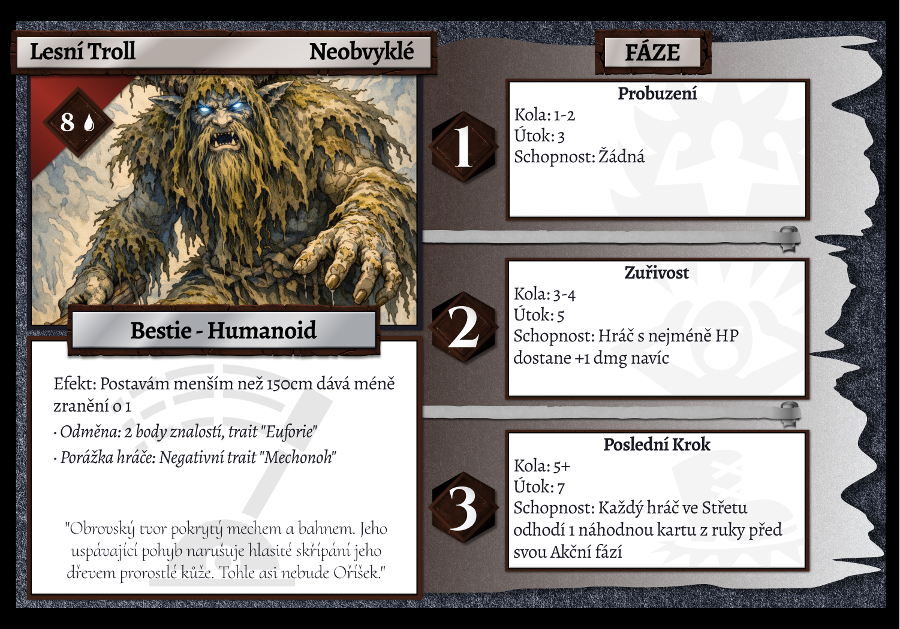
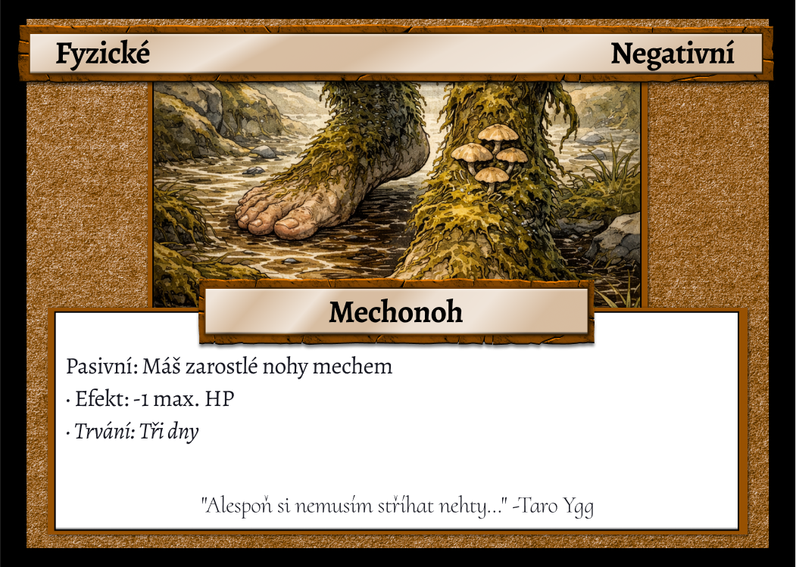

# RAENTIR - prototyp D&D/deck stolní hry

## ÚVOD

> help: pull first, push last, tag pouze na verzování minor jinak commit
> 
> git add .
> 
> git commit -m "verze"
> 
> git tag x.x.0 -m "název"
> 
> git push --tags
> 
> Poznámky a TODO jsou označny `takto`

#### Historie verzí:

###### v0.0.1 *1.4.2026*

- Vytvořen první dokument pravidel

###### v0.0.2 *2.4.2026*

- Vytvořena kostra pravidel

###### v0.0.3 *2.4.2026*

- Upravena struktura

- Přidány karty a traity

###### v0.0.4 *4.4.2026*

- Přidány templaty karet

- Rozšířeny pravidla

###### v0.1.0 (playtest_alpha) *4.4.2026*

- Přidány templaty všech typů herních karet

- Popsány funkce traitů

- Vytvořen **playtest** balíček základních karet, nepřítele a dvou postav

---

## PRAVIDLA

#### Cíl

Hra s deckbuilding kartami a vyprávěným příběhem podobně jako v D&D, kde se vypravěč aktivněji účastní soubojů proti ostatním hráčům a zároveň jim vede hru.

#### Vypravěč

Vede příběh, situace a ovládá nepřátele. Vytváří konflikty a udává následky. Hráči reagují pomocí roleplaye, v případě konfliktu vypravěč přechází do "režimu hráče" a vede souboj.

Vypravěč má tedy dvojí roli. Jednak vede příběh a jednak řídí obtížnost a tempo hry. Neměl by se snažit hráče „porazit“, ale vytvářet zajímavé situace.
Důležité je, že má nástroje, jak reagovat na hráče i mimo čistý boj. Může upravit svět, změnit reakce NPC, přidat postih ve formě negativního traitu a nebo naopak přidat pozitivní trait za kvalitní řešení situací stran hráčů. Má také možnost rozdávat speciální traity za určité milníky ve výpravě družiny nebo skupinové a dočasné traity.

#### Postavy

Nejsou definované a tvořené jako v klasickém D&D, ale pomocí traitů (pozitivní/negativní/speciální). Tyto traity - malé kartičky - ovlivňují chování postavy vůči světu a naopak. Jsou jak soubojové tak příběhové.

#### Souboje

Jsou vedeny kartami, které si do balíčku skládají hráči sami (tzv. deckbuilding). Hráči bojují proti vypravěčovi, který má pro každý encounter připravenou speciální kartu protivníka, která má efekty a fáze dle své tabulky. Souboj probíhá v tazích každého z hráčů po kolech, dokud jedna strana nevyhraje nebo se situace nevyřeší jinak. Čas je nepřítel, souboj se přirozeně eskaluje a hráči se snaží jej vyřešit co nejdříve, tak, aby měl nepřítel co nejméně fází. Hráč má v každém tahu volbu: bojovat nebo se odpoutat. 

###### Životy

Každý hráč má **HP - životy**, což je základní hodnota z povolání, modifikovaná traity. `Rozsah asi 15-20 base hp`. Nepřítel má **HP = x * počet hráčů***, kde x je dle karty nepřítele.

###### Iniciativa

Souboje začínají určením iniciativy. Každý hráč hodí kostkou **d6** a přičtou se **bonusy z traitů**. Hráč s největší iniciativou lízne v prvním kole o **1 kartu navíc**. Během souboje se nemění (pakliže speciální karta neřekne jinak).

###### Nepřátelé

Nemají plnohodnotný balíček. Všichni nepřátelé mají své základní karty. Na každou fázi útočí specifickými schopnostmi ze své karty. Fáze se posouvají po každém kole.

###### Kolo

Po tahu posledního hráče (dle iniciativy) se posouvá **fáze nepřítele**. Tím začíná nové kolo.

###### Tah

Ve svém tahu hráč lízne **5** karet ze svého balíčku do ruky a zahraje libovolný počet z nich. Vyhodnotí jejich efekt, případně hází kostkami. Na konci svého tahu musí hráč odhodit všechny (pakliže trait neříká jinak) své použité i nepoužité karty do odhazovacího balíčku. Poté hraje vypravěč za nepřítele.

**Postup:**

1. **Volební fáze:**
   
   1. - **Střet**
        
        - Hráč líže karty do 5 v ruce
        
        - Po jeho tahu na něj útočí nepřítel
      
      - **Odpoutání**
        
        - Hráč líže karty do 4 v ruce
        
        - Může hrát **pouze Speciální a Záchranné karty**
        
        - Nepřítel na něj **neútočí**
        
        - Může provádět RP akce a interagovat se světem

2. **Dobírací fáze**
   
   1. Hráč si doplní ruku dle volby

3. **Akční fáze**
   
   1. Hráč hraje libovolný počet karet
      
      - Efekty se vyhodnotí ihned (damage, heal, speciální).
      
      - Pokud karta vyžaduje hod kostkou, hráč hodí a vyhodnotí.
      
      - Obranné karty se v akční fázi **NEHRAJÍ ** - drží se v ruce na reaktivní obranu (viz krok 4)

4. **Fáze nepřítele** (pouze ve střetu)
   
   1. DM vyhodnotí útok nepřítele dle aktuální fáze na kartě nepřítele:
      
      1. Oznámí damage a případný speciální efekt 
      
      2. Hráč může v tento moment **reaktivně zahrát Obranné karty z ruky** a snížit incoming damage, tedy zahrát obranu nebo nechat kartu pro **Repurposed žetony**
      
      3. Efekty se vyhodnotí

5. **Repurposed**: Na konci tahu hráč odhodí všechny karty z ruky. Za každou **nepoužitou** odhozenou kartu dostane 1 Repurposed žeton. Žetony sbírá po celou dobu souboje. Kdykoliv zahraje **Útočnou kartu**, může přidat libovolný počet žetonů a zvýšit její **damage o +1 ** za žeton. **Tyto žetony se na konci celého souboje resetují.**

Vypravěč se hráče snaží porazit dle své speciální karty nepřítele a pokud se mu to podaří, přichází porážka hráče.

###### Porážka

Porážka nastane, když HP hráče klesne na 0 nebo níže.

Hráč je **poražen ** - dostane negativní nebo speciální trait (dle karty nepřítele). Ve svém tahu takový hráč nesmí lízat nové karty. Může hrát pouze kartu "Kostky osudu". Spoluhráči mohou poraženého zachránit `Záchrannou kartou`. Pakliže padne celá výprava mohou si hráči zvolit ukončení hry nebo "vzkříšení".

* **Vzkříšení**: Při vzkříšení hráči ožijí na posledním záchytném bodě.
  
  + **Záchytný bod**: Vytváří hráči dle "přesvědčení" (povinný speciální trait) buď "obětováním" nebo "rozjímáním". Hráči, který takový bod vytvořil se přidá dočasný negativní trait (tento má vypravěč u sebe).
+ **Schopnost vypravěče PÁKA**: Pakliže má vypravěč na své kartě nepřítele schopnost Páky, může ji ve svém tahu aktivovat. V tom případě se skupina musí vzdát, jinak poražená postava zemře nadobro. Vypravěč tuto schopnost využívá jako RP nástroj v případě nevyváženého souboje nebo postupu v příběhu.

###### Vítězství

Vítězství znamená, že souboj přežil alespoň jeden hráč. Hráči dostanou dočasný skupinový pozitivní trait "Euforie" a body znalostí.

* **Body znalostí**: Mohou hráči proměnit v deckbuildingu za nové karty nebo se nějakých karet z balíčku zbavit (více v sekci Karty a balíčky).

###### Následky a postup

Po každém souboji nebo důležité události dochází k posunu. Hráči mohou získat nové karty, upravit balíček nebo získat traity. Stejně tak mohou nést následky svých rozhodnutí.

#### Karty a balíčky

Každý hráč začíná s vlastním balíček o **osmi** základních kartách `Tyto jsou slabé, obyčejné` a **dvou** kartách z povolání a může si ho přes drafty zvětšit až na **25** karet. Karty reprezentují akce v boji (útoky, obrana, efekty) a nebo RP. Hráč má v ruce na začátku bojového tahu **max. 5** karet nebo **4** karty, když je **odpoutaný**.

Každá karta má pevně daný základní efekt (útok, obrana, efekt (heal apod.)). Některé karty mají i hod kostkou. Kostka ovšem neurčuje zda akce uspěje, ale modifikuje její sílu nebo efekt. Existují tedy riskantní a stabilní karty a hráč se musí rozhodnout, zda bude chtít větší bonus při hodu kostkou a nebo stabilní base staty.

Když hráč nemůže líznout dostatek karet (balíček je prázdný), zamíchá odhazovací balíček a lízne z něj.

###### Hromadný balík - deckbuilding

1. **Draft karet**
   
   1. Obecný draft
      
      1. Vypravěč lízne (počet hráčů + 10) karty z obecného hromadného balíčku
      
      2. Hráči si berou **po jedné v pořadí iniciativy**, dokud každý nemá **2** nové karty
      
      3. Zbytek se vrátí na dno balíku
   
   2. Třídní draft
      
      1. Každý hráč lízne **3** karty ze svého třídního balíčku (dle povolání)
      
      2. Vybere si **1** a zbylé vrátí

2. **Body znalostí**
   
   1. Každý hráč dostane **2 body** znalostí. Vypravěč může přidat 1 bod za výjimečný RP
   
   2. Utratit je lze ihned a nebo si je nechat na později:
      
      1. Extra karta z **obecného** balíčku navíc = **3** body (Lízne 3 karty a vybere 1 kartu)
      
      2. Extra karta z **třídního** balíčku navíc = **5** bodů (Lízne 3 karty a vybere 1 kartu)
      
      3. Odstranění karty z vlastního balíčku = **1** bod

###### Karta nepřítele

Nepřítel nemá balíček jako hráči. Má jednu **kartu nepřítele** s fázemi.

#### Kostky

Kostky slouží jako variace výsledku. Standardně se používá d6, ale může se objevit také d12. Hodnota na kostce se používá přímo.

Používají se taktéž jako vypravěčův nástroj pro rozhodnutí a souboje. `Toto bude potřeba lépe specifikovat (např. hráč má trait na přesvědčování - háže k tomu vypravěč?)`

#### Průběh hry

Hra se stříédá mezi vyprávěním a mechanikou. Vypravěč popisuje situaci, ve které se hráči nachází, ti reagují slovně a přitom mohou využít své traity. Pokud dojde ke konfliktu, přechází se do souboje, který je řízen kartami a kostkami. Výsledek se promítne do příběhu a zlepšování postav a hra pokračuje dál.

###### Růst postavy

1. Postavy levelí přes deck ve třech osách
   
   1. Kvalita decku: V draftu hráči nahrazují slabé karty silnějšími
   
   2. Třídní specializace: Postupem hry mají postavy více třídních karet v decku
   
   3. Traity: Pozitivní traity za questy, milníky = růst; Negativní traity jako následky `toto je jedna z možností jak DM může urychlit nebo zpomalit růst postav`

---

## Typy karet

#### Útočné

> Způsobují damage nepříteli
> 
> Mají base damage hodnotu
> 
> Některé mají hod kostkou (d6/d12) pro bonus
> 
> Lze je boostnout Repurposed žetony
> 
> Mají červenou barvu

#### Obranné

> Snižují incoming damage
> 
> Mají base obrannou hodnotu (kolik absorbují damage)
> 
> Hrají se reaktivně - ve chvíli, kdy nepřítel útočí
> 
> Mají modrou barvu

#### Speciální

> Různé efekty: Buff, Debuff, Manipulace s kartami, třídní schopnosti
> 
> Lze je hrát ve střetu i odpoutání
> 
> Mají žlutou barvu

#### Záchranné

> Pomáhají poraženým spoluhráčům
> 
> Efekty: Heal
> 
> Lze je hrát ve střetu i odpoutání
> Mají zelenou barvu

#### Třídní karty

> Mohou je používat pouze určené povolání
> 
> Mají bílou barvu

#### Nepřátelské karty

---

## TRAITY

> Mají status efekty
> 
> Jsou pasivní a aktivní
> 
> Vypravěč sleduje jaké traity hráči mají, hráči jsou povinni sledovat a hlásit efekty traitů, pakliže se mají vyhodnotit

#### Typy traitů

Traity se dělí na **permanentní** a **dočasné**.

* **Permanentní**: Zůstávají napořád, definují postavu. Jsou předtištěné na character sheetu (hráč si je zaškrtne). Patří sem povinné traity (jako přesvědčení), povolání a zásadní události. Speciální traity od Vypravěče jsou také permanentní - ty má u sebe Vypravěč u přehledu o skupině.

* **Dočasné**: Kartičky na stole. Mají trvání (kola, hodiny, dny, do konce souboje...) a přirozeně odpadávají. Hráč může mít najednou **max. 5 dočasných traitů**. Pokud by dostal další, vybere si, který stávající zahodí.

#### Skupiny dočasných traitů

Dočasné traity se třídí do skupin pro snazší orientaci v zásobě:

* **Soubojové** (Meč) — +dmg, -dmg, +obrana, blokování
* **Fyzické** (Tělo) — Mechonoh, Otrávený, Zraněný, Posílený
* **Mentální** (Oko) — Opilý, Vystrašený, Sou